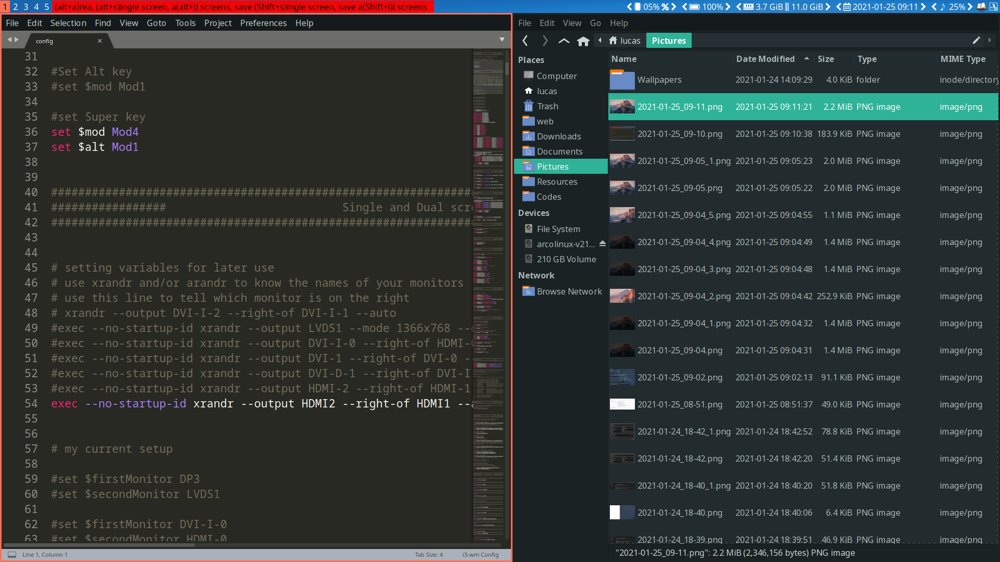
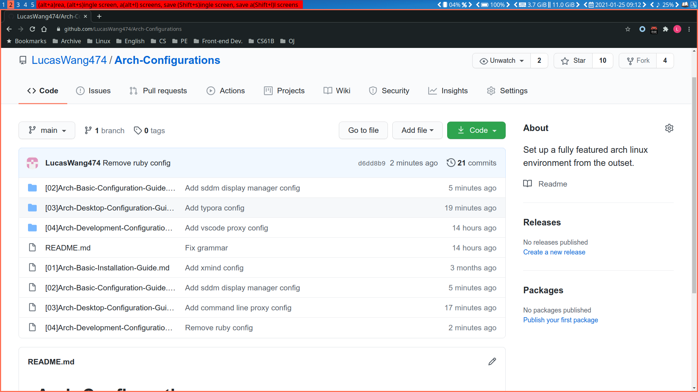
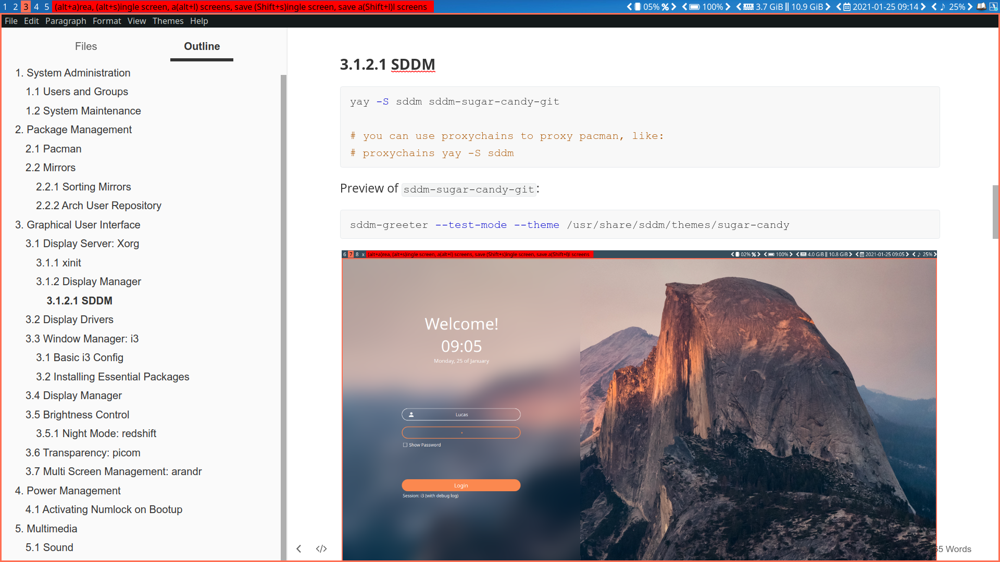
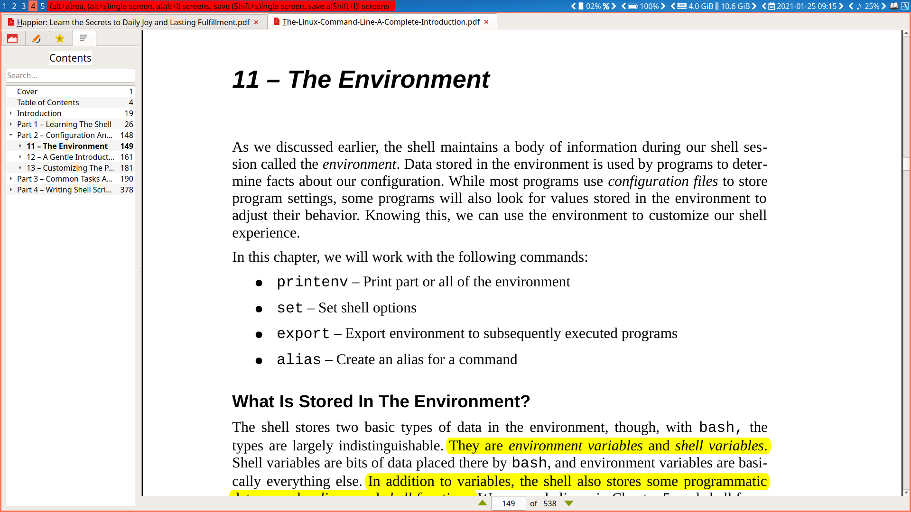
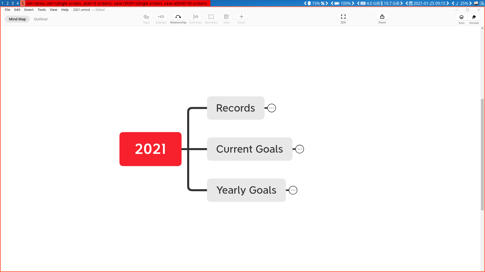
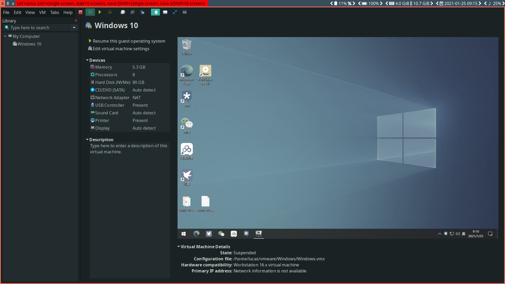
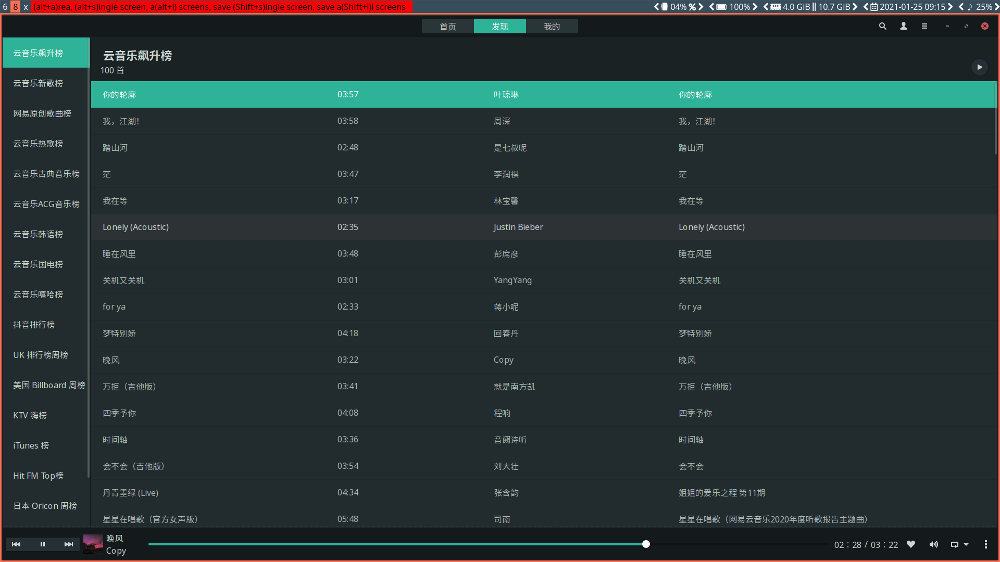
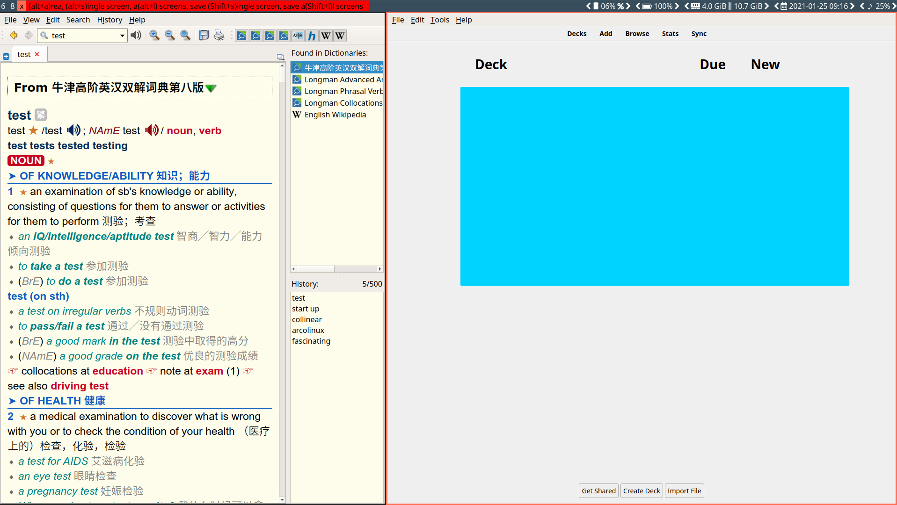
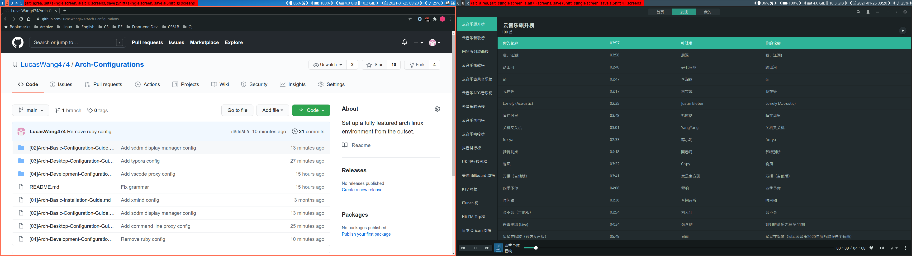

This repository has been archived. For new, see [LucasWang474/My-OS-Workflow: My operating system workflow. (Windows 10 + ArchLinux VM + Windows Terminal + VSCode) (github.com)](https://github.com/LucasWang474/My-OS-Workflow).

# Arch-Configurations

This repository will teach you how to build up a fully featured Arch Linux desktop environment from the outset.

## Screenshots

### Display Manager

### 1

### 2

### 3

### 4

### 5

### 6

### 8

### x

### Full

