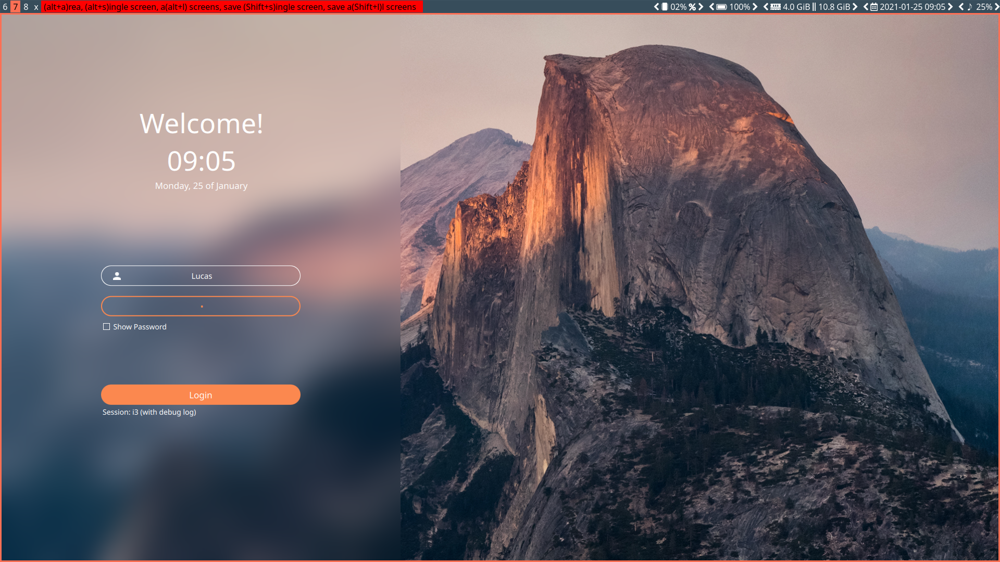
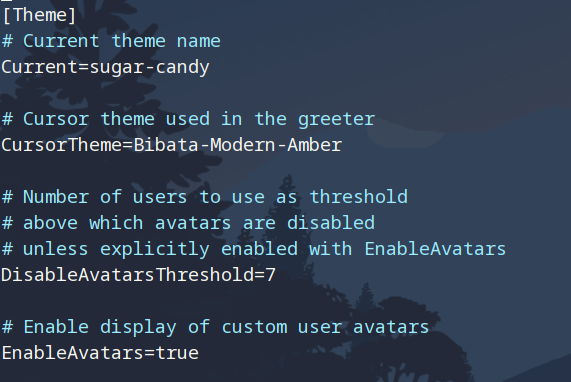

# 1. System Administration

## 1.1 Users and Groups

To add a new user, use the `useradd` command:

```bash
useradd -s /bin/fish -mG wheel,audio,video,optical,storage lucas

passwd lucas

pacman -S xdg-utils xdg-user-dirs
```

Then run `visudo` and uncomment `#%wheel ALL=(ALL) ALL`.


## 1.2 System Maintenance


# 2. Package Management

## 2.1 Pacman


## 2.2 Mirrors

### 2.2.1 Sorting Mirrors

```bash
sudo reflector -c China -f 10 --save /etc/pacman.d/mirrorlist
```


### 2.2.2 Arch User Repository

- [ArchlinuxCN](https://github.com/archlinuxcn/repo)

  ```bash
  # /etc/pacman.conf
  [archlinuxcn]
  Server = http://mirror.lzu.edu.cn/archlinuxcn/$arch
  ```

  **And** uncomment `#Color`.

  **Then:**

  ```bash
  sudo pacman -Syy && sudo pacman -S archlinuxcn-keyring
  sudo pacman -S yay
  ```


# 3. Graphical User Interface

## 3.1 Display Server: Xorg

```bash
sudo pacman -S xorg
```

### 3.1.1 xinit

```bash
sudo pacman -S xorg-xinit
cp /etc/X11/xinit/xinitrc .xinitrc
```

And edit `.xinitrc` later.


### 3.1.2 Display Manager

Note: 

- If you would like to use a display manager to start up your desktop, all the commands you have put in `~/.xinit` will not work anymore. 
- To make them work, you can put them in
  - `~.xprofile`
  - OR in a windows manager config file, like `i3wm`'s `~/.config/i3/config`


#### 3.1.2.1 SDDM

```bash
yay -S sddm sddm-sugar-candy-git

# you can use proxychains to proxy pacman, like:
# proxychains yay -S sddm
```

Preview of `sddm-sugar-candy-git`:

```bash
sddm-greeter --test-mode --theme /usr/share/sddm/themes/sugar-candy
```




> **Note:**
>
> - If you are now using another display manager, you have to disable it right now.


Then enable `sddm`:

```bash
sudo systemctl enable sddm.service
```

`sudo vim /usr/lib/sddm/sddm.conf.d/default.conf` to add the `sugar-candy` theme we just installed:




Now you can `reboot` or `loggout`(if you have stopped another display manager).


## 3.2 Display Drivers

```bash
sudo pacman -S xf86-video-amdgpu
```


## 3.3 Window Manager: i3

```bash
sudo pacman -S i3-wm i3lock i3status
yay -S i3exit
```

Edit `.xinitrc`:

```bash
exec i3
```


### 3.1 Basic i3 Config

Clone my config:

```bash
git clone https://github.com/LucasWang474/Dotfiles.git

mkdir .config/i3

cd Dotfiles/i3
ln config ~/.config/i3/config
ln i3status.conf ~/.config/i3/i3status.conf
```


### 3.2 Installing Essential Packages

```bash
sudo pacman -S xfce4-terminal chromium pcmanfm ttf-font-awesome rofi dmenu noto-fonts
```


## 3.4 Display Manager

```bash
sudo pacman -S lightdm lightdm-webkit2-greeter lightdm-webkit-theme-litarvan
sudo systemctl enable lightdm
```

**Then **

- **Edit** `/etc/lightdm/lightdm.conf` and **set**

  ```bash
  greeter-session=lightdm-webkit2-greeter
  ```

- **Edit** `/etc/lightdm/lightdm-webkit2-greeter.conf` and **set**

  ```bash
  detect_theme_errors = false
  webkit-theme = litarvan
  ```


## 3.5 Brightness Control

```bash
sudo pacman -S brightnessctl
```

Edit `~/.xprofile` OR `~/.xinit`:

```bash
brightnessctl set 15% &
```

If you are using `i3wm`, edit its config file:

```bash
bindsym XF86MonBrightnessUp exec --no-startup-id brightnessctl -q s +5%
bindsym XF86MonBrightnessDown exec --no-startup-id brightnessctl -q s 5%-

# exec --no-startup-id brightnessctl set 25% & # default brightness
```


### 3.5.1 Night Mode: redshift

```bash
sudo pacman -S redshift
```

Edit `~/.xprofile` OR `~/.xinit`:

```bash
redshift -P -O 4800 &
```


## 3.6 Transparency: picom

```bash
sudo pacman -S picom
```

Edit `~/.xprofile or ~/.xinit`:

```bash
picom &
```


## 3.7 Multi Screen Management: arandr

```bash
sudo pacman -S arandr
```


# 4. Power Management

## 4.1 Activating Numlock on Bootup

```bash
sudo pacman -S numlockx
```

Edit `.xinitrc` OR`.xprofile`:

```bash
numlockx &
```


# 5. Multimedia

## 5.1 Sound

```bash
sudo pacman -S pulseaudio pulseaudio-alsa pulseaudio-equalizer alsa-utils

sudo pacman -S pavucontrol playerctl
```


