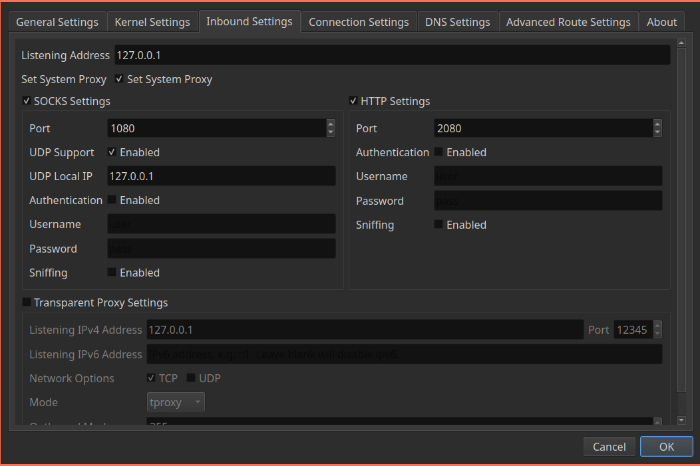
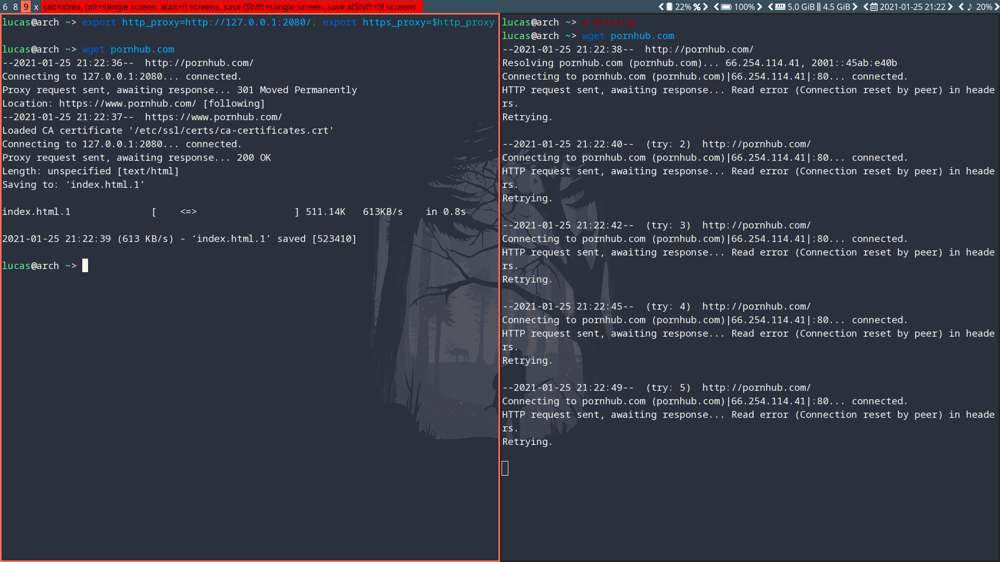
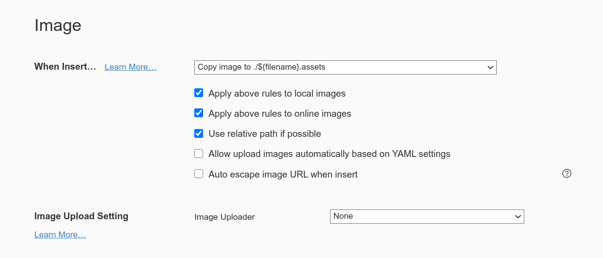

# Basic

## File Browser

```bash
sudo pacman -S pcmanfm file-roller p7zip unrar
sudo pacman -S thunar
```


### zip 压缩包乱码

> 避免方法：非 utf8 编码环境下（一般 windows 下的中文环境即是）不使用 zip 进行压缩（建议使用 [7z](https://wiki.archlinux.org/index.php/7z_(简体中文)))。 解决方案：安装使用 [unzip-iconv](https://aur.archlinux.org/packages/unzip-iconv/)AUR 或者 [unzip-natspec](https://aur.archlinux.org/packages/unzip-natspec/)AUR 取代原版的 [unzip](https://archlinux.org/packages/?name=unzip) 来解压缩，示例：
>
> ```
> $ unzip -O gbk file.zip
> ```
>
> `file.zip` 是压缩文件，`gbk` 是该文件的编码格式，以 `-O` 指定（原版 unzip 无 `-O` 选项）。

```bash
yay -S unzip-natspec p7zip-natspec
```

Then

```bash
unzip -O gbk file.zip
```


## Image

```bash
sudo pacman -S nomacs imagemagick gwenview feh
# sudo pacman -S gpicview gthumb
```


## PDF

```bash
sudo pacman -S okular evince

sudo pacman -S simple-scan
```


## Clock

```bash
sudo pacman -S gnome-clocks
```


## Download

```bash
sudo pacman -S uget aria2 qbittorrent
```


## Printer

```bash
sudo pacman -S cups hplip sudo pacman -S system-config-printer cups-pdf cups-pk-helper gutenprint splix foomatic-dbsudo systemctl enable cups
```


## Bluetooth

```bash
sudo pacman -S bluez bluez-utilssudo systemctl enable bluetooth
```


## Input

### Touchpad

#### Bug Fix: Lenovo Xiaoxin 15

The touchpad won't work out of the box most of the time. You need to unbind it from `elants_i2c` before binding it to `i2c_hid`.

**Run the below commands by switching to root user.**

```bash
sumodprobe i2c_hidecho "i2c-ELAN0001:00" > /sys/bus/i2c/drivers/i2c_hid/bindecho "i2c-ELAN0001:00" > /sys/bus/i2c/drivers/elants_i2c/unbind
```

The module `elants_i2c` now needs to be blacklisted, so you don't have to unbind and bind each time

```bash
echo "blacklist elants_i2c" | tee /etc/modprobe.d/touchpad.conf
```


#### Configuration

```bash
sudo pacman -S xf86-input-synaptics
```


 After installation of `xf86-input-synaptics`, a default configuration file is located at `/usr/share/X11/xorg.conf.d/70-synaptics.conf`. Users can copy this file to `/etc/X11/xorg.conf.d/` and edit it to configure the various driver options available. 

```bash
sudo ln -s 70-synaptics.conf /etc/X11/xorg.conf.d/
```


### Input Method

#### fcitx with sogoupinyin

```bash
yay -S fcitx fcitx-configtool fcitx-qt5 fcitx-sogoupinyin fcitx-qt4
```

**Set environment variables for IM modules**

Edit `~/.pam_environment`:

```bash
GTK_IM_MODULE DEFAULT=fcitxQT_IM_MODULE  DEFAULT=fcitxXMODIFIERS    DEFAULT=@im=fcitx
```


Now run `fcitx-configtool`.


**Set auto start:**

- Method 1

  Edit `i3wm` config:

  ```bash
  exec --no-startup-id fcitx-autostart
  ```

- Method 2

  Edit `~/.xinit`

  ```bash
  fcitx-autostart &
  ```

  


#### fcitx5

```bash
sudo pacman -S fcitx5-im fcitx5-chinese-addons
```

> [fcitx5-im](https://www.archlinux.org/groups/x86_64/fcitx5-im/) group provides [fcitx5](https://www.archlinux.org/packages/?name=fcitx5) ontology, [#Configuration tool](https://wiki.archlinux.org/index.php/Fcitx5#Configuration_tool), and all [#Input method module](https://wiki.archlinux.org/index.php/Fcitx5#Input_method_module) except [fcitx5-qt4-git](https://aur.archlinux.org/packages/fcitx5-qt4-git/)AUR.


**Set environment variables for IM modules**

To enable Fcitx5 normally in the program, you must set the following environment variables and log in again:

```
~/.pam_environmentINPUT_METHOD  DEFAULT=fcitx5GTK_IM_MODULE DEFAULT=fcitx5QT_IM_MODULE  DEFAULT=fcitx5XMODIFIERS    DEFAULT=\@im=fcitx5
```


## Office

### LibreOffice

```bash
yay -S libreoffice-fresh libreoffice-fresh-zh-cn
```


> The Document Foundation [wiki](https://wiki.documentfoundation.org/Fonts) mentions various fonts that are packaged by default with LibreOffice on Windows and macOS. 
>
> Also see [Fonts#Font packages](https://wiki.archlinux.org/index.php/Fonts#Font_packages).

```bash
yay -S ttf-caladea ttf-carlito ttf-dejavu ttf-gentium-basic ttf-liberation ttf-linux-libertine-g noto-fonts adobe-source-code-pro-fonts adobe-source-sans-pro-fonts adobe-source-serif-pro-fonts
```


### WPS

```bash
# yay -S wps-office-cn ttf-wps-fonts wps-office-mine-cn wps-office-mui-zh-cn
```


# System Management

## Partition

```bash
sudo pacman -S gparted
```


## System Information

```bash
sudo pacman -S htopsudo pacman -S neofetch sudo pacman -S hardinfo sudo pacman -S baobab # display disk usage in graph
```


# Multi Media

## Music Player

```bash
# sudo pacman -S netease-cloud-musicsudo pacman -S netease-cloud-music-gtk
```


## Video Player

**THE BEST VIDEO PLAYER EVER: MPV**

```bash
sudo pacman -S mpv
```


Others

```bash
sudo pacman -S mplayer vlc
```


## Capture

```bash
sudo pacman -S simplescreenrecorder # recordsudo pacman -S obs-studio # record and streamsudo pacman -S peek # gifsudo pacman -S guvcview cheese # camerasudo pacman -S screenkey # print the keys on the screen you entered sudo pacman -S flameshot # screenshot
```


# Display

## Multiple Monitors

```bash
sudo pacman -S arandr
```


## Fix Screen Tearing

### Create `/etc/X11/xorg.conf.d/20-amdgpu.conf`:

```bash
Section "Device"	Identifier "AMD"	Driver "amdgpu" 	Option "TearFree" "true"EndSection
```


### Picom

Try this setting in `picom.conf`:

```
vsync = true;
```


## Wallpaper

```bash
sudo pacman -S nitrogen
```


## GTK Themes

```bash
sudo pacman -S lxappearance # theme manager# gtk-themeyay -S arc-gtk-theme adapta-gtk-theme# icon-themesudo pacman -S papirus-icon-theme# cursor-themesudo pacman -S bibata-cursor-theme
```

**Fix cursor size:**

- Edit `~/.Xresources`

  ```bash
  Xcursor.size: 24
  ```


## QT Themes

```bash
sudo pacman -S qt5ct# sudo pacman -S kvantummanager
```

Edit `~/.xinitrc` OR `~/.xprofile`:

```bash
export QT_QPA_PLATFORMTHEME=qt5ct
```


## Picom

Copy my picom.conf.


**Note:** If you are using Linux as a virtual machine, transparency may not work. Try to uncomment this line:

```bash
vsync = true;
```


# Font

```bash
yay -S noto-fonts noto-fonts-emoji noto-fonts-cjk yay -S ttf-dejavu ttf-liberation ttf-symbola yay -S wqy-microhei wqy-microhei-lite adobe-source-han-sans-otc-fonts adobe-source-han-serif-otc-fonts adobe-source-han-serif-cn-fonts adobe-source-han-sans-cn-fonts wqy-zenhei wqy-bitmapfont ttf-arphic-ukai yay -S font-manager
```


## Fontconfig

**Template:**

```xml
<?xml version="1.0"?><!DOCTYPE fontconfig SYSTEM "fonts.dtd"><fontconfig>  settings go here --></fontconfig>
```


## Fix Displaying Japanese Characters While `Noto Sans CJK` Installed

```xml
<!-- ~/.config/fontconfig/fonts.conf --><?xml version="1.0"?><!DOCTYPE fontconfig SYSTEM "fonts.dtd"><fontconfig>	<!-- Set preferred serif, sans serif, and monospace fonts. -->    <alias>        <family>sans-serif</family>        <prefer>            <family>Noto Sans</family>            <family>Noto Sans CJK SC</family>            <family>Noto Sans CJK TC</family>            <family>Noto Sans CJK JP</family>            <family>Noto Sans CJK KR</family>            <family>Droid Sans</family>        </prefer>    </alias>    <alias>        <family>serif</family>        <prefer>            <family>Noto Serif</family>            <family>Noto Serif CJK SC</family>            <family>Noto Serif CJK TC</family>            <family>Noto Serif CJK JP</family>            <family>Noto Serif CJK KR</family>            <family>Droid Serif</family>        </prefer>    </alias>    <alias>        <family>monospace</family>        <prefer>            <family>Noto Sans Mono</family>            <family>Noto Sans Mono CJK SC</family>            <family>Noto Sans Mono CJK TC</family>            <family>Noto Sans Mono CJK JP</family>            <family>Noto Sans Mono CJK KR</family>            <family>Droid Sans Mono</family>        </prefer>    </alias>    <alias>        <family>mono</family>        <prefer>            <family>Noto Sans Mono</family>            <family>Noto Sans Mono CJK SC</family>            <family>Noto Sans Mono CJK TC</family>            <family>Noto Sans Mono CJK JP</family>            <family>Noto Sans Mono CJK KR</family>            <family>Droid Sans Mono</family>        </prefer>    </alias></fontconfig>
```


# Proxy

## Chromium

- Download `SwitchyOmega_Chromium.crx` from [SwitchyOmega](https://github.com/FelisCatus/SwitchyOmega) and rename it to `SwitchyOmega_Chromium.zip`.

  ```bash
  wget https://github.com/FelisCatus/SwitchyOmega/releases/download/v2.5.20/SwitchyOmega_Chromium.crx
  ```

- Go to chrome://extensions/ and enable Developer Mode.

- Then put `SwitchyOmega_Chromium.zip` into there.

  - Autoproxy: https://raw.githubusercontent.com/gfwlist/gfwlist/master/gfwlist.txt


## Clash

```bash
sudo pacman -S clashcd .config/clashwget -O config.yaml https://d.cloudso.club/link/????????????clash=1&log-level=infoclash -d ~/.config/clash
```


## V2ray

```bash
sudo pacman -S v2ray
```


### NO GUI

My workflow:

- First export client side config file from `v2rayN` or `qv2ray`.

  - socks and http

    ```json
        "inbounds": [        {            "tag": "proxy",            "port": 1081,            "listen": "127.0.0.1",            "protocol": "socks",            "sniffing": {                "enabled": true,                "destOverride": [                    "http",                    "tls"                ]            },            "settings": {                "auth": "noauth",                "udp": true,                "ip": null,                "address": null,                "clients": null,                "decryption": null            },            "streamSettings": null        },        {            "tag": "proxy",            "port": 1082,            "listen": "127.0.0.1",            "protocol": "http",            "sniffing": {                "enabled": true,                "destOverride": [                    "http",                    "tls"                ]            },            "settings": {                "auth": "noauth",                "udp": false            }        }    ],
    ```

- Then upload the config file.

  And check the config file.

  ```bash
  v2ray -test config.json
  ```

- Then

  ```bash
  sudo cp /etc/v2ray/config.json /etc/v2ray/config.json.baksudo cp config.json /etc/v2ray/config.jsonsudo systemctl enable v2ray sudo systemctl start v2ray
  ```

- Now test it.

  ```bash
  lucas@arch ~/Downloads> export http_proxy=http://127.0.0.1:1082/; export https_proxy=$http_proxy
  ```

  Note that your proxy port might be different.

  ```bash
  lucas@arch ~/Downloads> wget google.com--2021-02-05 00:43:55--  http://google.com/Connecting to 127.0.0.1:1082... connected.Proxy request sent, awaiting response... 301 Moved PermanentlyLocation: http://www.google.com/ [following]--2021-02-05 00:43:56--  http://www.google.com/Reusing existing connection to 127.0.0.1:1082.Proxy request sent, awaiting response... 200 OKLength: unspecified [text/html]Saving to: ‘index.html’index.html                                 [ <=>                                                                         ]  13.79K  --.-KB/s    in 0.009s2021-02-05 00:43:56 (1.48 MB/s) - ‘index.html’ saved [14117]
  ```

  


### GUI

```bash
sudo pacman -S qv2ray
```

Create `~/.config/qv2ray/init.sh `:

```bash
#!/bin/shkillall v2ray &sleep 2exec qv2ray
```

Then

```bash
chmod u+x ~/.config/qv2ray/init.sh
```


## Command line proxy

### By proxychains

```bash
sudo pacman -S proxychains
```

Edit `/etc/proxychains.conf`:

```bash
socks5 127.0.0.1 1080
```

> These "127.0.0.1 1080" stuff depends on your own proxy softwares' setting.
>
> Like:
>
> 

Then, `proxychains-ng` can be launched with

```bash
proxychains program
```

- You can even proxy `pacman`, like this

  ```bash
  suproxychains pacman -Syyu
  ```


### By setting environment variables

In terminal:

```bash
export http_proxy=http://127.0.0.1:2080/; export https_proxy=$http_proxy
```




# Coding and Learning

## Editor: Sublime Text

```bash
yay -S sublime-text-dev
```

**License Key:**

```
----- BEGIN LICENSE -----Member J2TeaMSingle User LicenseEA7E-1011316D7DA350E 1B8B0760 972F8B60 F3E64036B9B4E234 F356F38F 0AD1E3B7 0E9C5FADFA0A2ABE 25F65BD8 D51458E5 3923CE8087428428 79079A01 AA69F319 A1AF29A4A684C2DC 0B1583D4 19CBD290 217618CD5653E0A0 BACE3948 BB2EE45E 422D2C87DD9AF44B 99C49590 D2DBDEE1 75860FD28C8BB2AD B2ECE5A4 EFC08AF2 25A9B864------ END LICENSE ------
```


### i3wm Syntax Highlight

https://github.com/dcasella/i3wm-syntax

**Add this Repository:**

- `Ctrl/Command+Shift+P` to open the Command Palette
- Select `Package Control: Add Repository`
- Insert the URL `https://github.com/dcasella/i3wm-syntax`
- Press `Enter`
- `Ctrl/Command+Shift+P` to open the Command Palette
- Select `Package Control: Install Package`
- Search for `i3`
- Press `Enter`


## Terminal

### xfce4-terminal

```bash
sudo pacman -S xfce4-terminal
```

- Drop down mode

  ```bash
  xfce4-terminal --drop-down
  ```


## Markdown

```bash
sudo pacman -S typora
```




## Xmind

```bash
yay -S xmind-2020
```

Crack: https://ghpym.lanzous.com/b00zd6odc

> Windows crack file works in linux though.

```bash
lucas@arch ~/R/I/W/XmindZen> 7z x XMind_2020_10.3.1_Linux_补丁.7z lucas@arch ~/R/I/W/XmindZen> cd XMind_2020_10.3.1_Linux_补丁/lucas@arch ~/R/I/W/X/XMind_2020_10.3.1_Linux_补丁> lsapp.asar  使用说明.txtlucas@arch ~/R/I/W/X/XMind_2020_10.3.1_Linux_补丁> sudo mv /opt/XMind/resources/app.asar /opt/XMind/resources/app.asar.baklucas@arch ~/R/I/W/X/XMind_2020_10.3.1_Linux_补丁> sudo cp app.asar /opt/XMind/resources/app.asar 
```


## App Launcher

```bash
sudo pacman -S rofi # run rofi-theme-selector to select themesudo pacman -S gmrunsudo pacman -S xfce4-appfinder
```


## Anki

```bash
sudo pacman -S anki 
```


## Dictionary

```bash
sudo pacman -S goldendict hunspell hunspell-en_US
```

- https://freemdict.com/category/%e8%8b%b1%e8%af%ad/


​	


# Virtual Machine

## Vmware

**First install vmware,**

```bash
sudo pacman -S vmware-workstation
```

**Then,** as desired, enable some of the following services:

- `vmware-networks.service` for guest network access
- `vmware-usbarbitrator.service` for connecting USB devices to guest

**And** load the VMware modules:

```bash
sudo modprobe -a vmw_vmci vmmon
```

**Lastly,** entering the Workstation Pro license key from a terminal:

```bash
sudo /usr/lib/vmware/bin/vmware-vmx-debug --new-sn XXXXX-XXXXX-XXXXX-XXXXX-XXXXX
```

- If the above does not work, you can try:

  ```
  sudo /usr/lib/vmware/bin/vmware-enter-serial
  ```


### 16.0 License Key

```bash
ZF3R0-FHED2-M80TY-8QYGC-NPKYFYF390-0HF8P-M81RQ-2DXQE-M2UT6ZF71R-DMX85-08DQY-8YMNC-PPHV8
```


### **Fix `no 3D acceleration`**

`vim ~/.vmware/preferences`

```bash
mks.gl.allowBlacklistedDrivers = "TRUE"
```


### Install open-vm-tools

```bash
sudo pacman -S open-vm-tools gtk2 gtkmmsudo systemctl enable vmtoolsd.servicesudo systemctl enable vmware-vmblock-fuse.service
```


### Enable Window resolution autofit

```bash
sudo pacman -S gtk2 gtkmmsudo systemctl enable vmtoolsd.servicereboot
```

If it still does not work, try edit `/etc/mkinitcpio.conf`:

```bash
MODULES=(... vsock vmw_vsock_vmci_transport vmw_balloon vmw_vmci vmwgfx)
```

Then [regenerate the initramfs](https://wiki.archlinux.org/title/Regenerate_the_initramfs):

```bash
sudo mkinitcpio -p linuxreboot
```


### Fix `drag and drop` and `copy and paste` not working

Try running:

```bash
vmware-user # Tool to enable clipboard sharing (copy/paste) between host and guest.vmware-vmblock-fuse # Filesystem utility. Enables drag & drop functionality between host and guest through FUSE
```

To make this permanent

```bash
echo "vmware-user &" >> ~/.xprofileecho "vmware-vmblock-fuse &" >> ~/.xprofile
```


### Setup Shared Folder

- `vmhgfs-fuse` - Utility for mounting vmhgfs shared folders.

Share a folder by selecting *Edit virtual machine settings > Options > Shared Folders > Always enabled*, and creating a new share.

The shared folders should be visible with:

```bash
vmware-hgfsclient
```

Now the folder can be mounted:

```bash
mkdir <shared folders root directory>vmhgfs-fuse -o allow_other -o auto_unmount .host:/<shared_folder> <shared folders root directory>
```

Example:

```bash
mkdir $HOME/SHAREDvmhgfs-fuse -o allow_other -o auto_unmount .host:/D $HOME/SHARED
```


#### fstab

Add a rule for each share:

```bash
sudo echo '.host:/<shared_folder> <shared folders root directory> fuse.vmhgfs-fuse nofail,allow_other 0 0' >> /etc/fstab
```

Example:

```bash
sudo echo '.host:/D $HOME/SHARED fuse.vmhgfs-fuse nofail,allow_other 0 0' >> /etc/fstab
```


## Virtual Box

> [Install](https://wiki.archlinux.org/index.php/Install) the [virtualbox](https://www.archlinux.org/packages/?name=virtualbox) package. You will need to choose a package to provide host modules:
>
> - for the [linux](https://www.archlinux.org/packages/?name=linux) kernel choose [virtualbox-host-modules-arch](https://www.archlinux.org/packages/?name=virtualbox-host-modules-arch)
> - for any other [kernel](https://wiki.archlinux.org/index.php/Kernel) (including [linux-lts](https://www.archlinux.org/packages/?name=linux-lts)) choose [virtualbox-host-dkms](https://www.archlinux.org/packages/?name=virtualbox-host-dkms)

```bash
sudo pacman -S virtualbox virtualbox-host-modules-arch
```


### Load the VirtualBox kernel modules

```bash
sudo modprobe vboxdrv
```

The following modules are only required in advanced configurations:

- `vboxnetadp` and `vboxnetflt` are both needed when you intend to use the [bridged](https://www.virtualbox.org/manual/ch06.html#network_bridged) or [host-only networking](https://www.virtualbox.org/manual/ch06.html#network_hostonly) feature.

```bash
sudo modprobe vboxnetadp vboxnetflt
```


# System

## GRUB

**Timeout**

```bash
sudo vim /etc/default/grub
```

```bash
GRUB_TIMEOUT=2
```


**Alias**

```bash
alias update-grub='sudo grub-mkconfig -o /boot/grub/grub.cfg'
```


## Systemd

```bash
sudo vim /etc/systemd/system.conf
```

```bash
RebootWatchdogSec=10sShutdownWatchd1ogSec=10sDefaultTimeoutStartSec=5sDefaultTimeoutStopSec=5s
```


## Disable System Beep Alert

```bash
xset -b# sudo rmmod pcspkr
```


## Hibernate: Suspend to Disk

### 1. Get Block Device Name by UUID

#### 1.1 Swap Partition

```bash
┌─[lucas@ArchLinux] - [~] - [Fri Nov 06, 11:16]└─[$] <> lsblk                  NAME        MAJ:MIN RM   SIZE RO TYPE MOUNTPOINTnvme0n1     259:0    0 476.9G  0 disk ├─nvme0n1p1 259:1    0   500M  0 part /boot├─nvme0n1p2 259:2    0    12G  0 part [SWAP]└─nvme0n1p3 259:3    0 386.3G  0 part /┌─[lucas@ArchLinux] - [~] - [Fri Nov 06, 11:16]└─[$] <> ls -l /dev/disk/by-uuidtotal 0lrwxrwxrwx 1 root root 15 Nov  6 10:52 29cab58f-f852-4239-8687-885533b5e7e4 -> ../../nvme0n1p3lrwxrwxrwx 1 root root 15 Nov  6 10:52 66050937-2e5f-4508-bd21-f4335ee86c00 -> ../../nvme0n1p2lrwxrwxrwx 1 root root 15 Nov  6 10:52 98DA-BD3E -> ../../nvme0n1p1
```


#### 1.2 Swap File

```bash
sudo swap-offset /swapfile
```


### 2. Configure Kernel Parameters

Edit `/etc/default/grub` and append your kernel options between the quotes in the `GRUB_CMDLINE_LINUX_DEFAULT` line:

```bash
GRUB_CMDLINE_LINUX_DEFAULT="... resume=UUID=66050937-2e5f-4508-bd21-f4335ee86c00"
```

And then automatically re-generate the `grub.cfg` file with:

```bash
sudo grub-mkconfig -o /boot/grub/grub.cfg
```


The kernel parameters will only take effect after rebooting. 


#### Swapfile

Using a swap file requires also setting a `resume_offset=*swap_file_offset*` kernel parameters. 

The value of `*swap_file_offset*` can be obtained by running `filefrag -v *swap_file*`, the output is in a table format and the required value is located in the first row of the `physical_offset` column. For example:

```
# filefrag -v /swapfileFilesystem type is: ef53File size of /swapfile is 4294967296 (1048576 blocks of 4096 bytes) ext:     logical_offset:        physical_offset: length:   expected: flags:   0:        0..       0:      38912..     38912:      1:               1:        1..   22527:      38913..     61439:  22527:             unwritten   2:    22528..   53247:     899072..    929791:  30720:      61440: unwritten...
```

In the example the value of `*swap_file_offset*` is the first `38912` with the two periods.


### 3. Configure Initramfs

Edit `/etc/mkinitcpio.conf` and append `resume` to `HOOKS=(...)`:

```bash
HOOKS=(base udev ... resume)
```

Then regenerate the initramfs:

```bash
sudo mkinitcpio -p linux
```

Now reboot.

