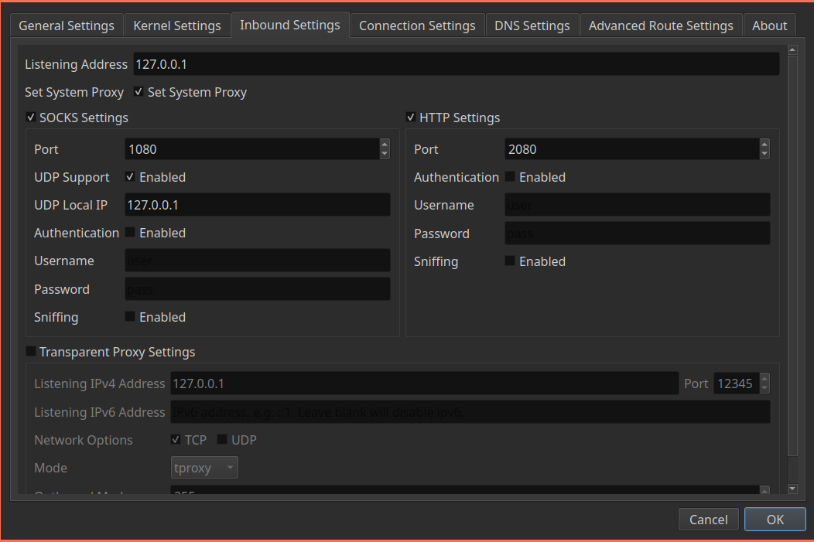
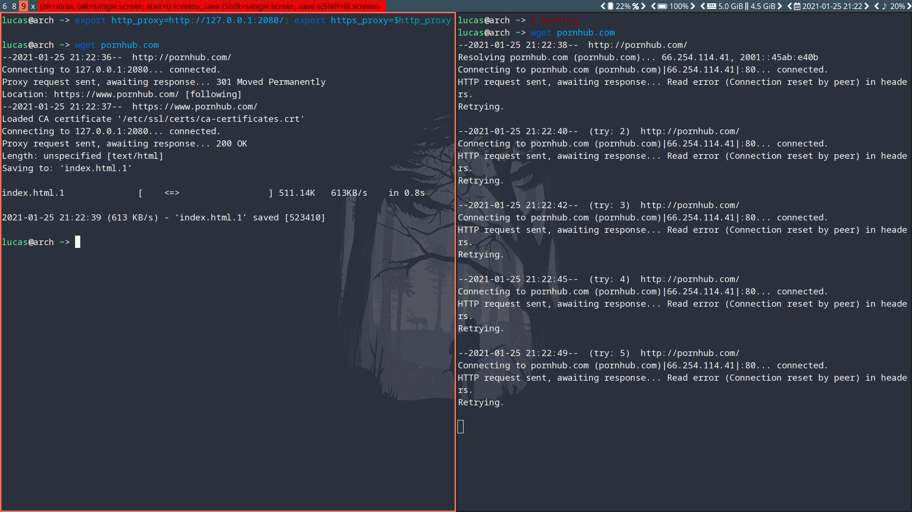

# Basic

## File Browser

```bash
sudo pacman -S pcmanfm file-roller p7zip unrar
```


## Image

```bash
sudo pacman -S gpicview gthumb
```


## PDF

```bash
sudo pacman -S okular

sudo pacman -S simple-scan
```


## Clock

```bash
sudo pacman -S gnome-clocks
```


## Download

```bash
sudo pacman -S uget aria2
```


## Partition

```bash
sudo pacman -S gparted
```


## System Information

```bash
sudo pacman -S htop
sudo pacman -S neofetch 
sudo pacman -S hardinfo 
sudo pacman -S baobab # display disk usage in graph
```


## Printer

```bash
sudo pacman -S cups system-config-printer cups-pdf cups-pk-helper gutenprint splix foomatic-db hplip
sudo systemctl enable org.cups.cupsd.service
```

Manage printers: http://localhost:631/


## [TO DO] Bluetooth

```bash
# sudo pacman -S bluez blueman blueberry
```


## Input

### Touchpad

#### Bug Fix: Lenovo Xiaoxin 15

The touchpad won't work out of the box most of the time. You need to unbind it from `elants_i2c` before binding it to `i2c_hid`.

**Run the below commands by switching to root user.**

```bash
su

modprobe i2c_hid

echo "i2c-ELAN0001:00" > /sys/bus/i2c/drivers/elants_i2c/unbind

echo "i2c-ELAN0001:00" > /sys/bus/i2c/drivers/i2c_hid/bind
```

The module `elants_i2c` now needs to be blacklisted, so you don't have to unbind and bind each time

```bash
echo "blacklist elants_i2c" | tee /etc/modprobe.d/touchpad.conf
```


#### Configuration

```bash
sudo pacman -S xf86-input-synaptics
```


 After installation of `xf86-input-synaptics`, a default configuration file is located at `/usr/share/X11/xorg.conf.d/70-synaptics.conf`. Users can copy this file to `/etc/X11/xorg.conf.d/` and edit it to configure the various driver options available. 

```bash
sudo ln -s 70-synaptics.conf /etc/X11/xorg.conf.d/
```


The following example file configures some common options, including vertical, horizontal and circular scrolling as well as tap-to-click:

```bash
/etc/X11/xorg.conf.d/70-synaptics.conf
Section "InputClass"
    Identifier "touchpad"
    Driver "synaptics"
    MatchIsTouchpad "on"
        Option "TapButton1" "1"
        Option "TapButton2" "3"
        Option "TapButton3" "2"
        Option "VertEdgeScroll" "on"
        Option "VertTwoFingerScroll" "on"
        Option "HorizEdgeScroll" "on"
        Option "HorizTwoFingerScroll" "on"
        Option "CircularScrolling" "on"
        Option "CircScrollTrigger" "2"
        Option "EmulateTwoFingerMinZ" "40"
        Option "EmulateTwoFingerMinW" "8"
        Option "CoastingSpeed" "0"
        Option "FingerLow" "30"
        Option "FingerHigh" "50"
        Option "MaxTapTime" "125"
        
        Option "PalmDetect" "1"
        Option "PalmMinWidth" "8"
        Option "PalmMinZ" "100"
EndSection
```


### Input Method

#### fcitx with sogoupinyin

```bash
yay -S fcitx fcitx-configtool fcitx-qt5 fcitx-sogoupinyin fcitx-qt4
```

**Set environment variables for IM modules**

Edit `~/.pam_environment`:

```bash
GTK_IM_MODULE DEFAULT=fcitx
QT_IM_MODULE  DEFAULT=fcitx
XMODIFIERS    DEFAULT=@im=fcitx
```


Now run `fcitx-configtool`.


**Set auto start:**

- Method 1

  Edit `i3wm` config:

  ```bash
  exec --no-startup-id fcitx-autostart
  ```

- Method 2

  Edit `~/.xinit`

  ```bash
  fcitx-autostart &
  ```

  


#### fcitx5

```bash
sudo pacman -S fcitx5-im fcitx5-chinese-addons
```

> [fcitx5-im](https://www.archlinux.org/groups/x86_64/fcitx5-im/) group provides [fcitx5](https://www.archlinux.org/packages/?name=fcitx5) ontology, [#Configuration tool](https://wiki.archlinux.org/index.php/Fcitx5#Configuration_tool), and all [#Input method module](https://wiki.archlinux.org/index.php/Fcitx5#Input_method_module) except [fcitx5-qt4-git](https://aur.archlinux.org/packages/fcitx5-qt4-git/)AUR.


**Set environment variables for IM modules**

To enable Fcitx5 normally in the program, you must set the following environment variables and log in again:

```
~/.pam_environment
INPUT_METHOD  DEFAULT=fcitx5
GTK_IM_MODULE DEFAULT=fcitx5
QT_IM_MODULE  DEFAULT=fcitx5
XMODIFIERS    DEFAULT=\@im=fcitx5
```


## Office

```bash
yay -S wps-office-cn ttf-wps-fonts wps-office-mine-cn wps-office-mui-zh-cn
```


# Multi Media

## Music Player

```bash
# sudo pacman -S netease-cloud-music
sudo pacman -S netease-cloud-music-gtk
```


## Video Player

```bash
sudo pacman -S mplayer mpv vlc
```


## Capture

```bash
sudo pacman -S simplescreenrecorder # record
sudo pacman -S obs-studio # record and stream
sudo pacman -S peek # gif
sudo pacman -S guvcview cheese # camera
sudo pacman -S screenkey # print the keys on the screen you entered 
sudo pacman -S flameshot # screenshot
```


# Display

## Multiple Monitors

```bash
sudo pacman -S arandr
```


## Fix Screen Tearing

### Create `/etc/X11/xorg.conf.d/20-amdgpu.conf`:

```bash
Section "Device"
	Identifier "AMD"
	Driver "amdgpu" 
	Option "TearFree" "true"
EndSection
```


### Picom

Try this setting in `picom.conf`:

```
vsync = true;
```


## Wallpaper

```bash
sudo pacman -S nitrogen
```


## GTK Themes

```bash
sudo pacman -S lxappearance # theme manager

# gtk-theme
yay -S matcha-gtk-theme arc-gtk-theme

# icon-theme
sudo pacman -S papirus-icon-theme

# cursor-theme
sudo pacman -S bibata-cursor-theme
```

**Fix cursor size:**

- Edit `~/.Xresources`

    ```bash
    Xcursor.size: 24
    ```


## QT Themes

```bash
sudo pacman -S qt5ct
# sudo pacman -S kvantummanager
```

Edit `~/.xinitrc` OR `~/.xprofile`:

```bash
export QT_QPA_PLATFORMTHEME=qt5ct
```


## Picom

```bash
#################################
#
# Backend
#
#################################

# Backend to use: "xrender" or "glx".
# GLX backend is typically much faster but depends on a sane driver.
backend = "glx";
#backend = "xrender"

#################################
#
# GLX backend
#
#################################

glx-no-stencil = true;

# GLX backend: Copy unmodified regions from front buffer instead of redrawing them all.
# My tests with nvidia-drivers show a 10% decrease in performance when the whole screen is modified,
# but a 20% increase when only 1/4 is.
# My tests on nouveau show terrible slowdown.
glx-copy-from-front = false;

# GLX backend: Use MESA_copy_sub_buffer to do partial screen update.
# My tests on nouveau shows a 200% performance boost when only 1/4 of the screen is updated.
# May break VSync and is not available on some drivers.
# Overrides --glx-copy-from-front.
# glx-use-copysubbuffermesa = true;

# GLX backend: Avoid rebinding pixmap on window damage.
# Probably could improve performance on rapid window content changes, but is known to break things on some drivers (LLVMpipe).
# Recommended if it works.
# glx-no-rebind-pixmap = true;

# GLX backend: GLX buffer swap method we assume.
# Could be undefined (0), copy (1), exchange (2), 3-6, or buffer-age (-1).
# undefined is the slowest and the safest, and the default value.
# copy is fastest, but may fail on some drivers,
# 2-6 are gradually slower but safer (6 is still faster than 0).
# Usually, double buffer means 2, triple buffer means 3.
# buffer-age means auto-detect using GLX_EXT_buffer_age, supported by some drivers.
# Useless with --glx-use-copysubbuffermesa.
# Partially breaks --resize-damage.
# Defaults to undefined.
#glx-swap-method = "undefined";

#################################
#
# Shadows
#
#################################

# Enabled client-side shadows on windows.
shadow = true;
# The blur radius for shadows. (default 12)
shadow-radius = 5;
# The left offset for shadows. (default -15)
shadow-offset-x = -5;
# The top offset for shadows. (default -15)
shadow-offset-y = -5;
# The translucency for shadows. (default .75)
shadow-opacity = 0.5;

log-level = "warn";
#change your username here
#log-file = "/home/erik/.config/compton.log";

# Set if you want different colour shadows
# shadow-red = 0.0;
# shadow-green = 0.0;
# shadow-blue = 0.0;

# The shadow exclude options are helpful if you have shadows enabled. Due to the way compton draws its shadows, certain applications will have visual glitches
# (most applications are fine, only apps that do weird things with xshapes or argb are affected).
# This list includes all the affected apps I found in my testing. The "! name~=''" part excludes shadows on any "Unknown" windows, this prevents a visual glitch with the XFWM alt tab switcher.
shadow-exclude = [
    "name = 'Notification'",
    "name = 'Plank'",
    "name = 'Docky'",
    "name = 'Kupfer'",
    "name = 'xfce4-notifyd'",
    "name *= 'VLC'",
    "name *= 'compton'",
    "name *= 'picom'",
    "name *= 'Chromium'",
    "name *= 'Chrome'",
    "class_g = 'Firefox' && argb",
    "class_g = 'Conky'",
    "class_g = 'Kupfer'",
    "class_g = 'Synapse'",
    "class_g ?= 'Notify-osd'",
    "class_g ?= 'Cairo-dock'",
    "class_g = 'Cairo-clock'",
    "class_g ?= 'Xfce4-notifyd'",
    "class_g ?= 'Xfce4-power-manager'",
    "_GTK_FRAME_EXTENTS@:c",
    "_NET_WM_STATE@:32a *= '_NET_WM_STATE_HIDDEN'"
];
# Avoid drawing shadow on all shaped windows (see also: --detect-rounded-corners)
shadow-ignore-shaped = false;

#################################
#
# Opacity
#
#################################

inactive-opacity = 1;
active-opacity = 1;
frame-opacity = 1;
inactive-opacity-override = false;

# Dim inactive windows. (0.0 - 1.0)
# inactive-dim = 0.2;
# Do not let dimness adjust based on window opacity.
# inactive-dim-fixed = true;
# Blur background of transparent windows. Bad performance with X Render backend. GLX backend is preferred.
# blur-background = true;
# Blur background of opaque windows with transparent frames as well.
# blur-background-frame = true;
# Do not let blur radius adjust based on window opacity.
blur-background-fixed = false;
blur-background-exclude = [
    "window_type = 'dock'",
    "window_type = 'desktop'",
    "_GTK_FRAME_EXTENTS@:c"
];

#################################
#
# Fading
#
#################################

# Fade windows during opacity changes.
fading = true;
# The time between steps in a fade in milliseconds. (default 10).
fade-delta = 4;
# Opacity change between steps while fading in. (default 0.028).
fade-in-step = 0.03;
# Opacity change between steps while fading out. (default 0.03).
fade-out-step = 0.03;
# Fade windows in/out when opening/closing
# no-fading-openclose = true;

# Specify a list of conditions of windows that should not be faded.
fade-exclude = [ ];

#################################
#
# Other
#
#################################

# Try to detect WM windows and mark them as active.
mark-wmwin-focused = true;
# Mark all non-WM but override-redirect windows active (e.g. menus).
mark-ovredir-focused = true;
# Use EWMH _NET_WM_ACTIVE_WINDOW to determine which window is focused instead of using FocusIn/Out events.
# Usually more reliable but depends on a EWMH-compliant WM.
use-ewmh-active-win = true;
# Detect rounded corners and treat them as rectangular when --shadow-ignore-shaped is on.
detect-rounded-corners = true;

# Detect _NET_WM_OPACITY on client windows, useful for window managers not passing _NET_WM_OPACITY of client windows to frame windows.
# This prevents opacity being ignored for some apps.
# For example without this enabled my xfce4-notifyd is 100% opacity no matter what.
detect-client-opacity = true;

# Specify refresh rate of the screen.
# If not specified or 0, picom will try detecting this with X RandR extension.
refresh-rate = 0;

# Vertical synchronization: match the refresh rate of the monitor
# this breaks transparency in virtualbox - put a "#" before next line to fix that
vsync = true;

# Enable DBE painting mode, intended to use with VSync to (hopefully) eliminate tearing.
# Reported to have no effect, though.
dbe = false;

# Limit picom to repaint at most once every 1 / refresh_rate second to boost performance.
# This should not be used with --vsync drm/opengl/opengl-oml as they essentially does --sw-opti's job already,
# unless you wish to specify a lower refresh rate than the actual value.
#sw-opti = true;

# Unredirect all windows if a full-screen opaque window is detected, to maximize performance for full-screen windows, like games.
# Known to cause flickering when redirecting/unredirecting windows.
unredir-if-possible = false;

# Specify a list of conditions of windows that should always be considered focused.
focus-exclude = [ ];

# Use WM_TRANSIENT_FOR to group windows, and consider windows in the same group focused at the same time.
detect-transient = true;
# Use WM_CLIENT_LEADER to group windows, and consider windows in the same group focused at the same time.
# WM_TRANSIENT_FOR has higher priority if --detect-transient is enabled, too.
detect-client-leader = true;

#################################
#
# Window type settings
#
#################################

wintypes:
{
  tooltip = { fade = true; shadow = true; opacity = 0.9; focus = true;};
  dock = { shadow = false; }
  dnd = { shadow = false; }
  popup_menu = { opacity = 0.9; }
  dropdown_menu = { opacity = 0.9; }
};

######################
#
# XSync
# See: https://github.com/yshui/compton/commit/b18d46bcbdc35a3b5620d817dd46fbc76485c20d
#
######################

# Use X Sync fence to sync clients' draw calls. Needed on nvidia-drivers with GLX backend for some users.
xrender-sync-fence = true;
```


# Font

```bash
sudo pacman -S noto-fonts noto-fonts-emoji noto-fonts-cjk
yay -S font-manager
```


## Fontconfig

**Template:**

```xml
<?xml version="1.0"?>
<!DOCTYPE fontconfig SYSTEM "fonts.dtd">
<fontconfig>

  settings go here -->

</fontconfig>
```


## Fix Displaying Japanese Characters While `Noto Sans CJK` Installed

```xml
<!-- ~/.config/fontconfig/fonts.conf -->

<?xml version="1.0"?>
<!DOCTYPE fontconfig SYSTEM "fonts.dtd">
<fontconfig>
	<alias>
		<family>sans-serif</family>
		<prefer>
			<family>Noto Sans</family>
			<family>Noto Sans CJK SC</family>
			<family>Noto Sans CJK TC</family>
			<family>Noto Sans CJK JP</family>
			<family>Noto Sans CJK KR</family>
		</prefer>
	</alias>
	<alias>
		<family>serif</family>
		<prefer>
			<family>Noto Serif</family>
			<family>Noto Serif CJK SC</family>
			<family>Noto Serif CJK TC</family>
			<family>Noto Serif CJK JP</family>
			<family>Noto Serif CJK KR</family>
		</prefer>
	</alias>
	<alias>
		<family>monospace</family>
		<prefer>
			<family>Noto Sans Mono</family>
			<family>Noto Sans Mono CJK SC</family>
			<family>Noto Sans Mono CJK TC</family>
			<family>Noto Sans Mono CJK JP</family>
			<family>Noto Sans Mono CJK KR</family>
		</prefer>
	</alias>
</fontconfig>
```


# Proxy

## Chromium

- Download `SwitchyOmega_Chromium.crx` from [SwitchyOmega](https://github.com/FelisCatus/SwitchyOmega) and rename it to `SwitchyOmega_Chromium.zip`.
- Go to chrome://extensions/ and enable Developer Mode.
- Then put `SwitchyOmega_Chromium.zip` into there.

    - Autoproxy: https://raw.githubusercontent.com/gfwlist/gfwlist/master/gfwlist.txt


## V2ray

```bash
sudo pacman -S v2ray qv2ray-dev-git 
```

Create `~/.config/qv2ray/init.sh `:

```bash
#!/bin/sh

killall v2ray &
sleep 2
exec qv2ray
```

Then

```bash
chmod u+x ~/.config/qv2ray/init.sh
```


## Command line proxy

### By proxychains

```bash
sudo pacman -S proxychains
```

Edit `/etc/proxychains.conf`:

```bash
socks5 127.0.0.1 1080
```

> These "127.0.0.1 1080" stuff depends on your own proxy softwares' setting.
>
> Like:
>
> 

Then, `proxychains-ng` can be launched with

```bash
proxychains program
```

- You can even proxy `pacman`, like this

  ```bash
  su
  proxychains pacman -Syyu
  ```


### By setting environment variables

In terminal:

```bash
export http_proxy=http://127.0.0.1:2080/; export https_proxy=$http_proxy
```




> You may set the `all_proxy` environment variable to let curl and pacman (which uses curl) use your socks5 proxy:
>
> ```bash
> export all_proxy="socks5://your.proxy:1080"
> ```


# Coding and Learning

## Editor: Sublime Text

```bash
yay -S sublime-text-dev
```

**License Key:**

```
----- BEGIN LICENSE -----
Member J2TeaM
Single User License
EA7E-1011316
D7DA350E 1B8B0760 972F8B60 F3E64036
B9B4E234 F356F38F 0AD1E3B7 0E9C5FAD
FA0A2ABE 25F65BD8 D51458E5 3923CE80
87428428 79079A01 AA69F319 A1AF29A4
A684C2DC 0B1583D4 19CBD290 217618CD
5653E0A0 BACE3948 BB2EE45E 422D2C87
DD9AF44B 99C49590 D2DBDEE1 75860FD2
8C8BB2AD B2ECE5A4 EFC08AF2 25A9B864
------ END LICENSE ------
```


### i3wm Syntax Highlight

https://github.com/dcasella/i3wm-syntax

**Add this Repository:**

- `Ctrl/Command+Shift+P` to open the Command Palette
- Select `Package Control: Add Repository`
- Insert the URL `https://github.com/dcasella/i3wm-syntax`
- Press `Enter`
- `Ctrl/Command+Shift+P` to open the Command Palette
- Select `Package Control: Install Package`
- Search for `i3`
- Press `Enter`


## Terminal

### xfce4-terminal

```bash
sudo pacman -S xfce4-terminal
```

- Drop down mode

  ```bash
  xfce4-terminal --drop-down
  ```


## Markdown

```bash
sudo pacman -S typora
```


## Xmind

```bash
yay -S xmind-2020
```

Crack: https://www.programmersought.com/article/51234700250/

> Windows crack file is working in linux though.


## App Launcher

```bash
sudo pacman -S rofi
sudo pacman -S gmrun
sudo pacman -S xfce4-appfinder
```


## Anki

```bash
sudo pacman -S anki 
```


## Dictionary

```bash
sudo pacman -S goldendict hunspell hunspell-en_US
```

- https://freemdict.com/category/%e8%8b%b1%e8%af%ad/


# Virtual Machine

## Anbox

**Linux Zen**

You need to run a kernel which comes with the ashmem and binder modules. The [linux-zen](https://archlinux.org/packages/?name=linux-zen) kernel includes the necessary options.

```bash
sudo pacman -S linux-zen linux-zen-headers
```

Then reboot with the new kernel.


Anbox does not load the modules on demand, starting an app will fail if they are not loaded.

To load them right now, use:

```bash
sudo modprobe -a binder-linux ashmem-linux
```


**Install Anbox**

```bash
yay -S anbox-git
```

Afterwards. [start/enable](https://wiki.archlinux.org/index.php/Start/enable) `anbox-container-manager.service`.


**Network Via NetworkManager**

If you are using [NetworkManager](https://wiki.archlinux.org/index.php/NetworkManager) you can use it to configure the networking.

Execute the following command to create the bridge connection:

```
$ nmcli con add type bridge ifname anbox0 -- connection.id anbox-net ipv4.method shared ipv4.addresses 192.168.250.1/24
```


**Installing apps**

```bash
sudo pacman -S android-tools
```

To install `*/path/to/app.apk*`

```bash
adb install /path/to/app.apk
```


**Start anbox**

```bash
anbox launch --package=org.anbox.appmgr --component=org.anbox.appmgr.AppViewActivity
```


## Vmware

**First install vmware,**

```bash
sudo pacman -S vmware-workstation
```

**Then,** as desired, enable some of the following services:

- `vmware-networks.service` for guest network access
- `vmware-usbarbitrator.service` for connecting USB devices to guest

**And** load the VMware modules:

```bash
sudo modprobe -a vmw_vmci vmmon
```

**Lastly,** entering the Workstation Pro license key from a terminal:

```bash
sudo /usr/lib/vmware/bin/vmware-vmx-debug --new-sn XXXXX-XXXXX-XXXXX-XXXXX-XXXXX
```

- If the above does not work, you can try:

    ```
    sudo /usr/lib/vmware/bin/vmware-enter-serial
    ```


### 16.0 License Key

```bash
ZF3R0-FHED2-M80TY-8QYGC-NPKYF
YF390-0HF8P-M81RQ-2DXQE-M2UT6
ZF71R-DMX85-08DQY-8YMNC-PPHV8
```


### **Fix `no 3D acceleration`**

`vim ~/.vmware/preferences`

```bash
mks.gl.allowBlacklistedDrivers = "TRUE"
```


## Virtual Box

> [Install](https://wiki.archlinux.org/index.php/Install) the [virtualbox](https://www.archlinux.org/packages/?name=virtualbox) package. You will need to choose a package to provide host modules:
>
> - for the [linux](https://www.archlinux.org/packages/?name=linux) kernel choose [virtualbox-host-modules-arch](https://www.archlinux.org/packages/?name=virtualbox-host-modules-arch)
> - for any other [kernel](https://wiki.archlinux.org/index.php/Kernel) (including [linux-lts](https://www.archlinux.org/packages/?name=linux-lts)) choose [virtualbox-host-dkms](https://www.archlinux.org/packages/?name=virtualbox-host-dkms)

```bash
sudo pacman -S virtualbox virtualbox-host-modules-arch
```


### Load the VirtualBox kernel modules

```bash
sudo modprobe vboxdrv
```

The following modules are only required in advanced configurations:

- `vboxnetadp` and `vboxnetflt` are both needed when you intend to use the [bridged](https://www.virtualbox.org/manual/ch06.html#network_bridged) or [host-only networking](https://www.virtualbox.org/manual/ch06.html#network_hostonly) feature.

```bash
sudo modprobe vboxnetadp vboxnetflt
```


# System

## GRUB

**Timeout**

```bash
sudo vim /etc/default/grub
```

```bash
GRUB_TIMEOUT=2
```


**Alias**

```bash
alias update-grub=‘sudo grub-mkconfig -o /boot/grub/grub.cfg'
```


## Systemd

```bash
sudo vim /etc/systemd/system.conf
```

```bash
RebootWatchdogSec=10s
ShutdownWatchd1ogSec=10s
DefaultTimeoutStartSec=5s
DefaultTimeoutStopSec=5s
```


## Disable System Beep Alert

```bash
xset -b
```


## Hibernate: Suspend to Disk

### 1. Get Block Device Name by UUID

#### 1.1 Swap Partition

```bash
┌─[lucas@ArchLinux] - [~] - [Fri Nov 06, 11:16]
└─[$] <> lsblk                  
NAME        MAJ:MIN RM   SIZE RO TYPE MOUNTPOINT
nvme0n1     259:0    0 476.9G  0 disk 
├─nvme0n1p1 259:1    0   500M  0 part /boot
├─nvme0n1p2 259:2    0    12G  0 part [SWAP]
└─nvme0n1p3 259:3    0 386.3G  0 part /

┌─[lucas@ArchLinux] - [~] - [Fri Nov 06, 11:16]
└─[$] <> ls -l /dev/disk/by-uuid

total 0
lrwxrwxrwx 1 root root 15 Nov  6 10:52 29cab58f-f852-4239-8687-885533b5e7e4 -> ../../nvme0n1p3
lrwxrwxrwx 1 root root 15 Nov  6 10:52 66050937-2e5f-4508-bd21-f4335ee86c00 -> ../../nvme0n1p2
lrwxrwxrwx 1 root root 15 Nov  6 10:52 98DA-BD3E -> ../../nvme0n1p1
```


#### 1.2 Swap File

```bash
sudo swap-offset /swapfile
```


### 2. Configure Kernel Parameters

Edit `/etc/default/grub` and append your kernel options between the quotes in the `GRUB_CMDLINE_LINUX_DEFAULT` line:

```bash
GRUB_CMDLINE_LINUX_DEFAULT="... resume=UUID=66050937-2e5f-4508-bd21-f4335ee86c00"
```

And then automatically re-generate the `grub.cfg` file with:

```bash
sudo grub-mkconfig -o /boot/grub/grub.cfg
```


The kernel parameters will only take effect after rebooting. 


#### Swapfile

Using a swap file requires also setting a `resume_offset=*swap_file_offset*` kernel parameters. 

The value of `*swap_file_offset*` can be obtained by running `filefrag -v *swap_file*`, the output is in a table format and the required value is located in the first row of the `physical_offset` column. For example:

```
# filefrag -v /swapfile
Filesystem type is: ef53
File size of /swapfile is 4294967296 (1048576 blocks of 4096 bytes)
 ext:     logical_offset:        physical_offset: length:   expected: flags:
   0:        0..       0:      38912..     38912:      1:            
   1:        1..   22527:      38913..     61439:  22527:             unwritten
   2:    22528..   53247:     899072..    929791:  30720:      61440: unwritten
...
```

In the example the value of `*swap_file_offset*` is the first `38912` with the two periods.


### 3. Configure Initramfs

Edit `/etc/mkinitcpio.conf` and append `resume` to `HOOKS=(...)`:

```bash
HOOKS=(base udev ... resume)
```

Then regenerate the initramfs:

```bash
sudo mkinitcpio -p linux
```

Now reboot.


