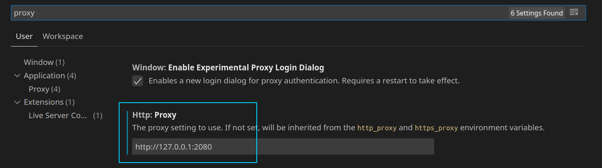
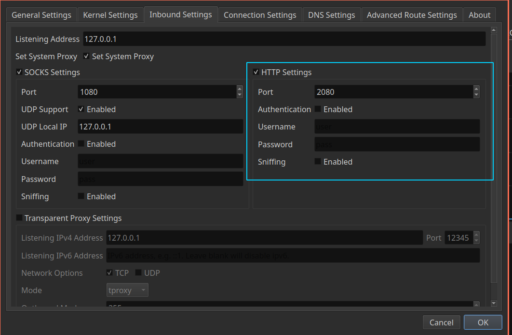
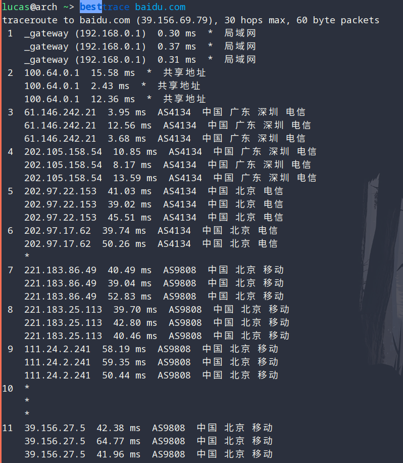

# C

```bash
yay -S gcc cmake gdb lldb
```


## Clion

```bash
yay -S clion 
# yay -S clion-cmake clion-gdb clion-jre clion-lldb # optional
```


# Java

```bash
yay -S jdk-openjdk openjdk-doc # latest
yay -S jdkX-openjdk openjdkX-doc # version X
```


## Set default Java environment

```bash
sudo archlinux-java status
sudo archlinux-java set java-X-openjdk
```


## Intellij

```bash
sudo pacman -S intellij-idea-ultimate-edition intellij-idea-ultimate-edition-jre
```


### Intellij's official tutorial (Highly recommend)

Press `Ctrl+Shift+A` and search `learn`, then `enter`.


### Fix `fish: Unable to open universal variable file '...': Permission denied`

```bash
sudo ln -s ~/.config/fish/fish_variables /opt/intellij-idea-ultimate-edition/plugins/terminal/fish/fish_variables
```


# Git

## Init

Run

```bash
git config --global user.email "you@example.com"
git config --global user.name "Your Name"
```

to set your account's default identity.

Omit `--global` to set the identity only in this repository.


## How to fix Git always asking for user credentials

- Make Git store the user name and password and it will never ask for them.

    ```bash
    git config --global credential.helper store
    ```


# VIM

`~/.vimrc`:

```bash
set clipboard=unnamedplus

filetype plugin on

syntax on

set number

set relativenumber

"set spell

set incsearch

set hlsearch
```


## Clipboard

You can `:set clipboard=unnamedplus` to use the `"+` register instead. The `"+` register corresponds to the `CLIPBOARD` buffer in X.


## Syntax highlighting

To enable syntax highlighting for many programming languages:

```
:filetype plugin on
:syntax on
```


## Indentation

The indent file for specific file types can be loaded with:

```
:filetype indent on
```


## Line numbers

To show the line number column, use `:set number`. By default absolute line numbers are shown, relative numbers can be enabled with `:set relativenumber`. Setting both enables hybrid line numbers - the current line is absolute, while the others are relative.


## Highlighting search results

In order to highlight the first string that will be matched in a search while typing the search, add the following line to your `~/.vimrc`:

```
set incsearch
```

In order to highlight all strings that will be matched in a search while typing the search, and after the search has been executed, add the following line to your `~/.vimrc`:

```
set hlsearch
```


# Shell

## Fish

```bash
sudo pacman -S fish

yay -S fisher

set -U fish_greeting ""

fish_config
```


**Plugins**

> - [awesome.fish](https://github.com/jorgebucaran/awesome.fish)

- [fish-abbreviation-tips](https://github.com/Gazorby/fish-abbreviation-tips)

    ```bash
    fisher install Gazorby/fish-abbreviation-tips
    ```

- [z](https://github.com/jethrokuan/z) 

  **z** is a port of [z](https://github.com/rupa/z) for the [fish shell](https://fishshell.com/).

  ```bash
  fisher install jethrokuan/z
  ```

  


## ZSH

```bash
sudo pacman -S zsh-completions
```


trash-cli


- [Oh-my-zsh](https://github.com/ohmyzsh/ohmyzsh)

    ```bash
    sh -c "$(curl -fsSL https://raw.github.com/ohmyzsh/ohmyzsh/master/tools/install.sh)"
    ```

- [Syntax highlight](https://github.com/zsh-users/zsh-syntax-highlighting/blob/master/INSTALL.md)

    ```bash
    git clone https://github.com/zsh-users/zsh-syntax-highlighting.git ${ZSH_CUSTOM:-~/.oh-my-zsh/custom}/plugins/zsh-syntax-highlighting
    ```

- Autojump

    ```bash
    sudo pacman -S autojump
    ```

    Edit `~/.zshrc`:

    ```bash
    source /etc/profile.d/autojump.sh
    ```

- [zsh-autosuggestions](https://github.com/zsh-users/zsh-autosuggestions/blob/master/INSTALL.md)

    ```bash
    git clone https://github.com/zsh-users/zsh-autosuggestions ${ZSH_CUSTOM:-~/.oh-my-zsh/custom}/plugins/zsh-autosuggestions
    ```

    


# Python

## Ipython and Jupyter Notebook

```bash
sudo pacman -S ipython jupyter-notebook
```


## Pycharm

```bash
sudo pacman -S pycharm-community-edition
```


# Web

## VS Code

```bash
sudo pacman -S code
sudo pacman -S nodejs npm 
```


### Proxy

Press `Ctrl+,` to open `Settings`, then search `proxy`.



**Note that the port `2080`** depends on your configuration in the proxy software, like `qv2ray`.

And this is my setting in `qv2ray`, just a reference.




## Route trace

```bash
yay -S besttrace
```



